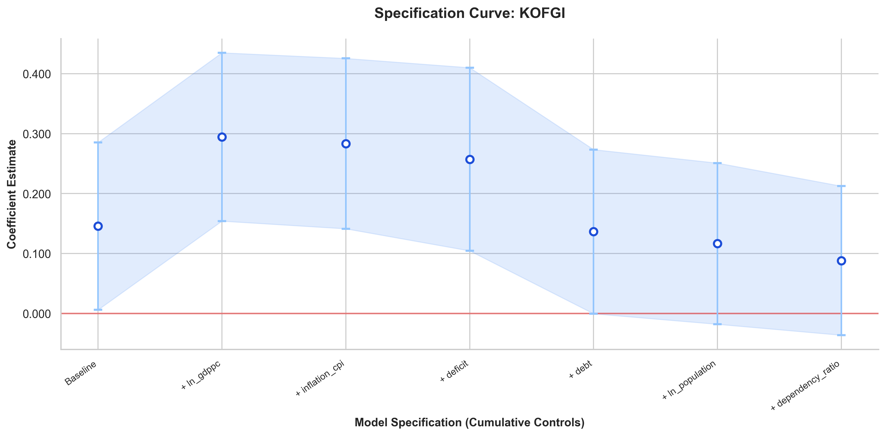
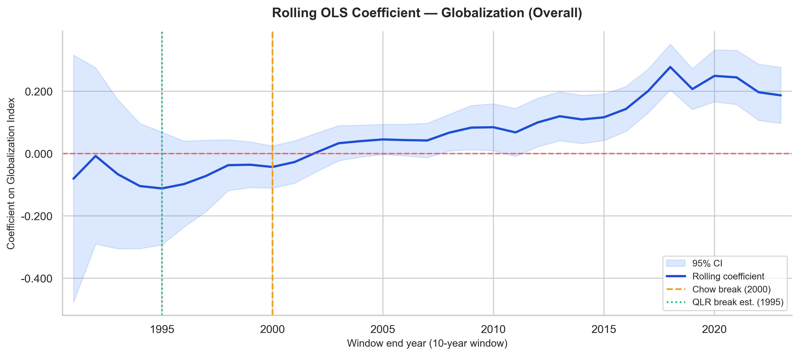

## Introduction

The welfare state has undergone significant transformations over the past few decades.
This presentation explores the impact of **globalization** on social security transfers.

- Are Welfare states shrinking?
- Did the China Shock (2000) create a structural break?
- What was the impact of the Global Financial Crisis (2008)?

---

## The Core Relationship: Globalization vs Social Security

We analyze the KOF Globalization Index's effect on social security transfers as a percentage of GDP. 

The baseline model indicates a robust positive relationship, controlling for macroeconomic factors.

---

## Stability of the Effect: Stepwise Robustness

The specification curve below demonstrates that the overall globalization coefficient remains largely stable when introducing consecutive macroeconomic controls.

{fig-align="center" width="80%"}

---

## A Changing Tide? Structural Breaks

When we test for a structural break around the China Shock (2000), we see interesting shifts in the 10-year Rolling OLS coefficient estimates.

{width="80%"}

---

## Conclusion

1. Globalization initially sparked welfare state expansion (Compensation Hypothesis).
2. However, the impact varies significantly over time (Pre/Post China Shock).
3. We are implementing Event Study designs to exactly pinpoint the transition during the Global Financial Crisis.
